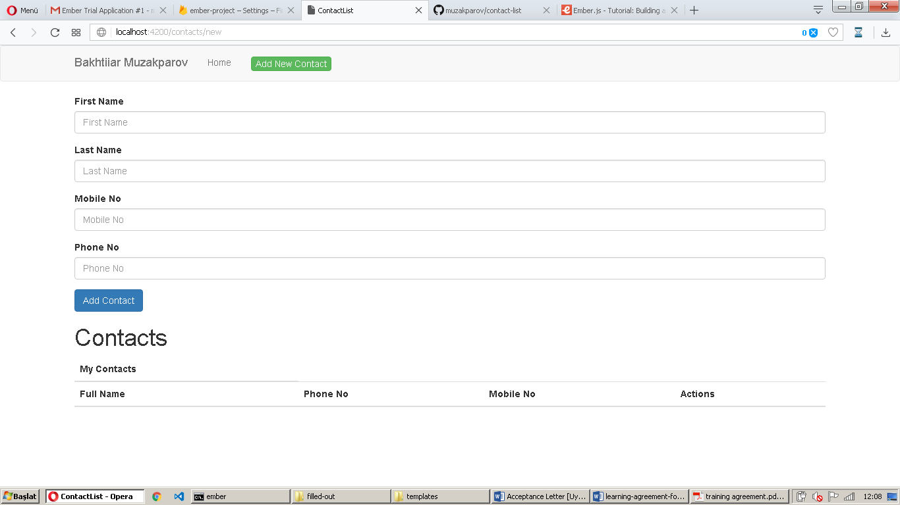
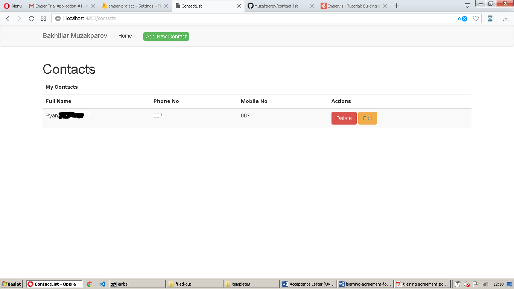

# Contact-list

I used bootstrap for styling and firebase for database.

It meets minimum requirement with Delete Button.

I failed to implement Edit though, there was only one good resource about this Uncaught Error and probably the solution was to work with components and event handlers.

It would take some more time to fix it, I think. My unanswered stackoverflow on it: https://stackoverflow.com/questions/46058047/attempted-to-handle-event-deleterecord-on-contact-someid-while-in-state-roo

Overall, Ember.js turned to be pretty fast and cool. :) Thanks for giving me an opportunity to get acquianted with it.

  

  

